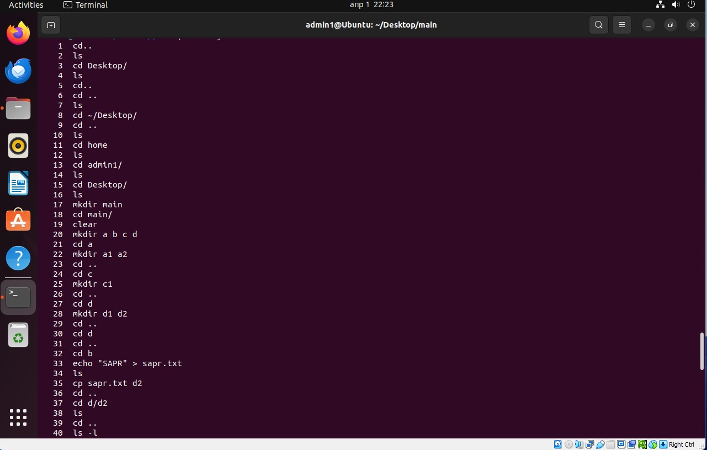
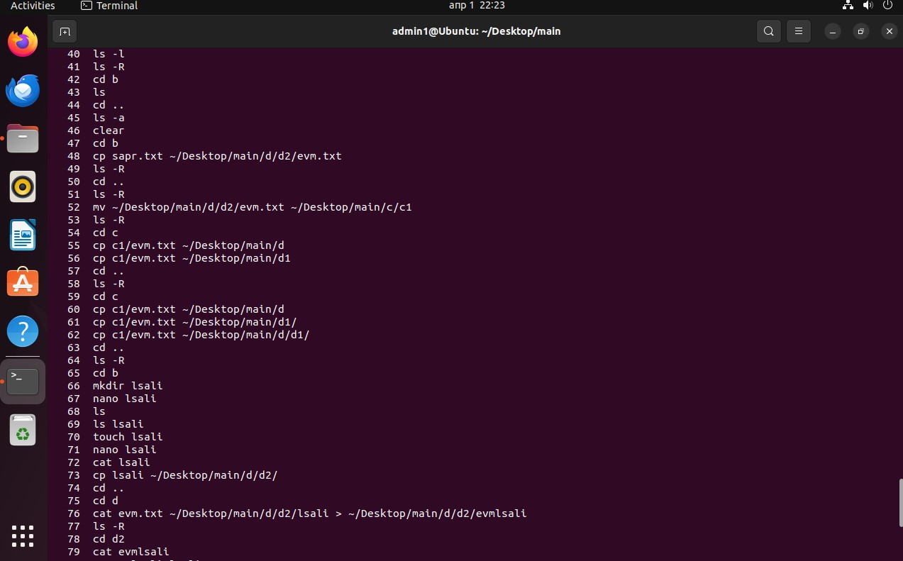
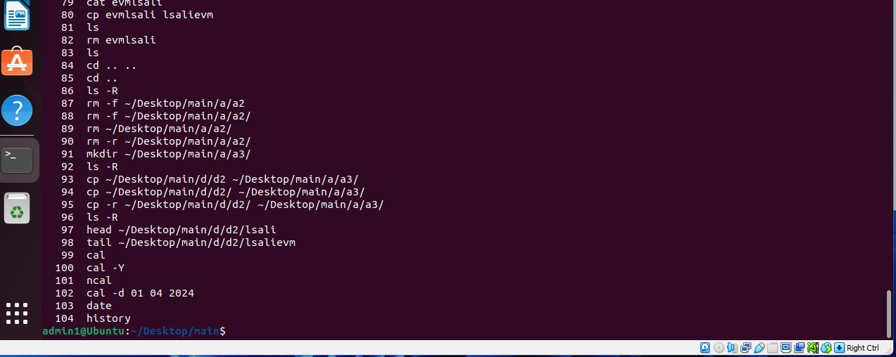
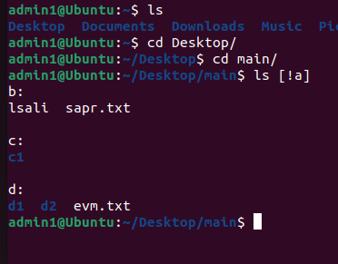

1.	ls -d  - Показать информацию о директории. Не выводить ее содержимое 
ls -i  - Выводить индекс файла (номер индексного дескриптора inode). 
ls -t  - Сортировка по времени изменения файлов. Новые располагаются в начале списка 
ls -r  - Сортировать список файлов в обратном порядке. 
2.	ls -v - Сортировать по номеру версии файлов. Например, если файлы имеют имена myfile-1.txt, myfile-2.txt и так далее. В данном случае в именах файлов автоматически определяется версия и по ней осуществляется сортировка. 
ls -w – Задает ширину колонки при выводе списка. 
ls -l – Вывод подробной информации о файлах. 
ls -S – Сортировать по размеру файлов. Большие файлы располагаются в начале списка. 
3.	ls -R – Выводить содержимое всех директорий (рекурсивный обход директорий). 
ls -F – Добавить специальные символы к именам файлов, которые показывают, что это за файл. Возможные символы: 
/ - директория 
"*" - исполняемый файл.  
"@" - символическая ссылка. 
"=" - сокет. 
">" - door. 
"|" - именованная очередь FIFO (pipe). 
ls -A – Выводить все файлы, включая скрытые, но не показывать . и .. 
ls -U – Отключить сортировку. 
4.	ls -X – Сортировать по расширению файлов. 
ls -C – Выводить файлы колонками 
ls -full-time – Вывод времени в длинном формате. 
ls -h – При использовании совместно с опцией -l или -ls выводить размер файлов в понятном формате (например, 105K, 12M). 
5.	pwd - Выводит полный путь текущей рабочей директории 
6.	cd - Переход в домашнюю директорию. После команды можно указать абсолютный путь к директории. 
cd ~ - Переход на домашнюю директорию пользователя. 
7.	rm - Удаляение файлов или директорий.
8.	rmdir - Удаление каталогов, только пустых
9.	mv - Переносит файлы из одной директории в другую.
10.	cp - Копирование файла.
11.	cat - Команда чтения файла
12.	

